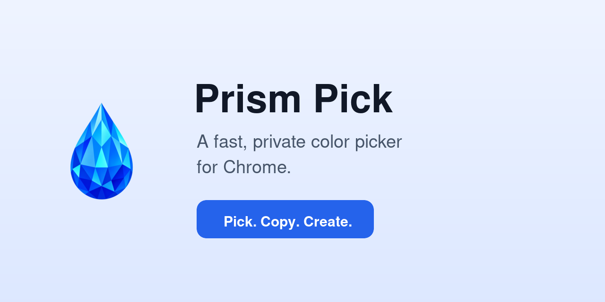
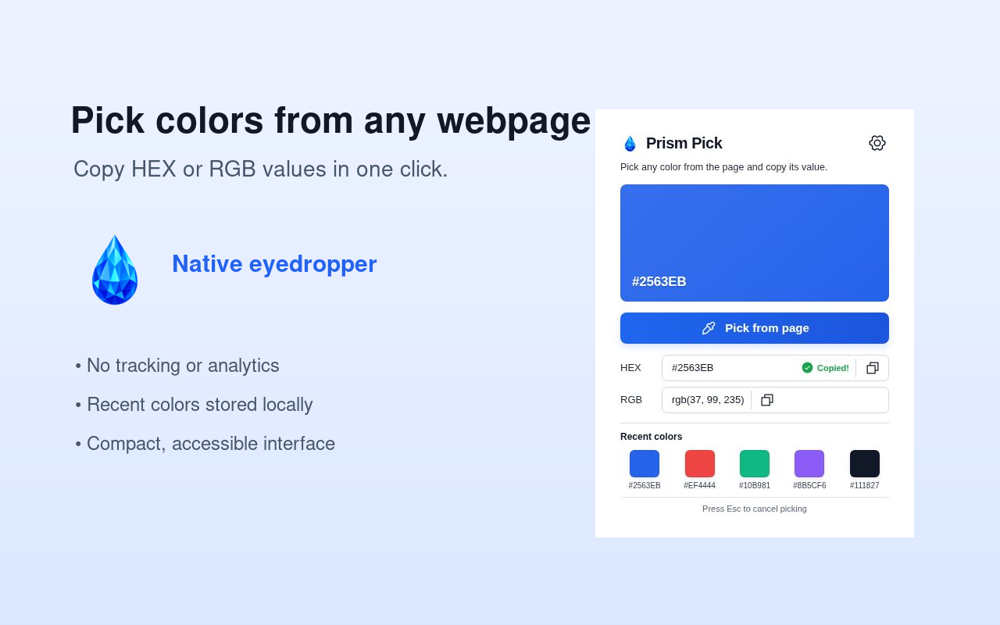

# Prism Pick



Prism Pick is a lightweight, privacy-friendly Manifest V3 Chrome extension that samples colors from webpages, copies HEX or RGB values, and remembers five recent colors.

> Pick a color. Copy the value. Keep creating.

## Features

- Pick colors from any webpage with Chrome's native EyeDropper API.
- Copy HEX and RGB values with visible success feedback.
- Reuse the five most recent colors.
- Clear recent-color history from the settings menu.
- Keyboard-accessible controls and visible focus states.
- No analytics, advertising, accounts, or remote code.

## Screenshots



## Build

```bash
npm install
npm run build
```

The unpacked extension is produced in `dist/`. A ready-to-share ZIP can be created with `npm run package`.

Run the complete release validation with:

```bash
npm run verify
```

## Load in Chrome

1. Open `chrome://extensions`.
2. Turn on **Developer mode**.
3. Choose **Load unpacked** and select the `dist` folder.

The native EyeDropper API is used when the extension runs in Chrome. In an ordinary web preview, Prism Pick falls back to the browser's color input so the interface remains testable.

## Validation

The production build, Manifest V3 configuration, icon set, store-asset dimensions, copy actions, recent swatches, settings menu, and picker fallback are validated before publishing.

## Privacy

Prism Pick stores recent colors only on the user's device through `chrome.storage.local`. It does not collect, transmit, sell, or share personal data. See [PRIVACY.md](PRIVACY.md).

## Chrome Web Store materials

All listing copy, privacy answers, publishing notes, screenshots, promotional tiles, and the upload checklist are in [`store-listing/`](store-listing/) and [`store-assets/`](store-assets/).

## Contributing and security

Contributions are welcome. Read [CONTRIBUTING.md](CONTRIBUTING.md) before opening a pull request. Please report vulnerabilities using [SECURITY.md](SECURITY.md), not a public issue.

## License

Released under the [MIT License](LICENSE).
